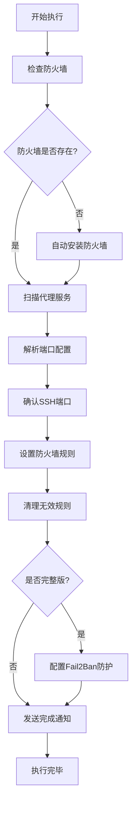

# VPS 自动维护脚本集合

一套专为代理服务（Xray、Sing-box）服务器设计的自动化维护和安全加固脚本，让你的 VPS 既安全又易于管理。

## 🚀 主要功能

- **智能端口检测**：自动识别 Xray 和 Sing-box 的服务端口
- **防火墙自动配置**：支持 UFW 和 Firewalld，无需手动设置
- **SSH 安全保护**：智能保留 SSH 端口，避免被意外锁定
- **端口最小化**：关闭所有不必要的端口，减少攻击面
- **Fail2Ban 防御**：自动封禁暴力破解的 IP 地址
- **Telegram 通知**：实时推送维护状态和安全警报
- **自动化更新**：定时更新系统、代理核心和规则文件

支持 Ubuntu、Debian、CentOS、RHEL、Fedora 等主流 Linux 发行版。

## 📋 脚本概览

| 脚本名称 | 适用场景 |
|---------|---------|
| `detect_ports_ultimate_add_Fail2Ban.sh` | **推荐使用**：完整的安全加固版本 |
| `detect_ports_ultimate.sh` | 基础防火墙配置 |
| `deploy.sh` | 部署长期自动化维护系统 |

## 🛠️ 快速开始

### 🔒 一键安全加固（推荐）

最简单的方式，一条命令搞定所有安全配置：

```bash
bash <(curl -sL https://raw.githubusercontent.com/FTDRTD/Vps-auto-maintain/main/detect_ports_ultimate_add_Fail2Ban.sh)
```

> 💡 **小贴士**：如果你更喜欢 wget，也可以这样用：
> ```bash
> bash <(wget -qO- https://raw.githubusercontent.com/FTDRTD/Vps-auto-maintain/main/detect_ports_ultimate_add_Fail2Ban.sh)
> ```

### 🛡️ 基础防火墙配置

如果你只需要简单的防火墙设置：

```bash
bash <(curl -sL https://raw.githubusercontent.com/FTDRTD/Vps-auto-maintain/main/detect_ports_ultimate.sh)
```

### 🚀 部署自动化维护

想要长期自动化的维护？用这个脚本：

```bash
bash <(curl -sL https://raw.githubusercontent.com/FTDRTD/Vps-auto-maintain/main/deploy.sh)
```

### 📥 传统方式下载

不放心一键执行？可以先下载检查：

```bash
# 下载完整版
curl -O https://raw.githubusercontent.com/FTDRTD/Vps-auto-maintain/main/detect_ports_ultimate_add_Fail2Ban.sh
chmod +x detect_ports_ultimate_add_Fail2Ban.sh

# 执行脚本
./detect_ports_ultimate_add_Fail2Ban.sh
```

## ⚙️ 高级配置

### 🔔 Telegram 通知设置

想收到维护和安全警报的通知？添加你的 Telegram Bot 配置：

```bash
# 添加自定义通知（推荐下载后执行）
./detect_ports_ultimate_add_Fail2Ban.sh --token "YOUR_BOT_TOKEN" --chat-id "YOUR_CHAT_ID"
```

不想接收通知？简单禁用就好：

```bash
./detect_ports_ultimate_add_Fail2Ban.sh --no-notify
```

> ⚠️ **安全提示**：虽然一键执行很方便，但在生产环境建议先下载脚本检查内容后再运行。

### ⏰ 自动化维护时间

部署脚本会设置两个定时任务：

- **核心维护**：系统更新 + 代理核心升级 + 服务重启（每天东京时间凌晨 4:00）
- **规则更新**：仅更新 Xray 规则文件（每天北京时间早上 7:00）

## 🔧 兼容性

### 支持的代理服务
- **Xray**：自动检测运行端口和配置文件端口
- **Sing-box**：支持多种配置路径

### 系统支持
- **防火墙**：自动选择 UFW（Ubuntu/Debian）或 Firewalld（CentOS/RHEL）
- **入侵防护**：Fail2Ban 自动防护 SSH 暴力破解
- **包管理**：支持 apt、dnf、yum 等更新机制

## 🛡️ 安全机制解析

### 端口管理策略
1. **智能扫描**：自动检测正在运行的代理服务端口
2. **配置文件解析**：读取 JSON 配置获取所有监听端口
3. **SSH 安全保障**：永远保留 SSH 端口，避免自己被锁在门外
4. **规则优化**：清理所有不必要的端口规则，保持防火墙简洁

### Fail2Ban 防护机制
- **SSH 暴力破解防护**：10分钟内失败5次登录，自动封禁1小时
- **自启动服务**：系统重启后自动恢复防护
- **实时监控**：持续监测 SSH 登录日志，及时响应异常

## 📊 脚本执行流程



## 📋 系统要求

### 最低配置
- **操作系统**：Ubuntu/Debian/CentOS/RHEL/Fedora 等 Linux 发行版
- **权限要求**：需要 sudo 或 root 权限
- **网络连接**：能访问软件源和 Telegram API（可选）

### 推荐配置
- **内存**：512MB 以上
- **存储空间**：1GB 可用空间
- **预装服务**：Xray 或 Sing-box 代理服务

## 🔍 常见问题与解决方案

遇到问题别慌，这里有最常见的解决方案：

### 防火墙安装问题
如果脚本提示防火墙安装失败：

```bash
# Ubuntu/Debian 用户
sudo apt update && sudo apt upgrade

# CentOS/RHEL 用户
sudo yum update  # 或 dnf update
```

### Telegram 通知不工作
检查 Bot 配置是否正确：

```bash
# 简单测试你的 Bot
curl -X POST "https://api.telegram.org/bot你的BOT_TOKEN/sendMessage" \
     -d chat_id="你的CHAT_ID" -d text="测试消息"
```

### 代理端口检测不到
检查服务是否正常运行：

```bash
# 查看服务状态
sudo systemctl status xray
sudo systemctl status sing-box

# 检查端口占用情况
sudo ss -tlnp | grep -E "(xray|sing-box)"
```

### 系统状态检查命令
快速诊断系统状态：

```bash
# 防火墙状态
sudo ufw status verbose          # 如果用 UFW
sudo firewall-cmd --list-all     # 如果用 Firewalld

# Fail2Ban 运行情况
sudo fail2ban-client status sshd
sudo systemctl status fail2ban

# 查看定时任务
crontab -l
```

## 🤝 参与贡献

欢迎任何形式的贡献！

### 本地开发环境
```bash
git clone https://github.com/FTDRTD/Vps-auto-maintain.git
cd Vps-auto-maintain
```

### 测试建议
⚠️ **重要**：请在测试环境验证所有更改，确保不会影响生产环境。

## 📄 开源协议

本项目采用 [MIT 许可证](LICENSE)，你可以自由使用、修改和分发。

## 🆘 获取帮助

遇到问题时，按这个顺序寻求帮助：

1. 先看看上面的[常见问题](#常见问题与解决方案)
2. 在 [Issues](https://github.com/FTDRTD/Vps-auto-maintain/issues) 搜索类似问题
3. 提交新的 Issue 详细描述你的情况
4. 如果配置了 Telegram 通知，可以通过 Bot 获取实时支持

---

💡 **温馨提示**：这些脚本会修改系统防火墙配置，建议先在测试环境验证一切正常后再部署到生产环境。