# VPS 自动维护脚本集合

一套完整的 VPS 服务器自动化维护和安全加固脚本，专为运行代理服务（Xray、Sing-box）的服务器设计。

## 🚀 功能特色

### 核心功能
- **智能端口检测**: 自动识别 Xray 和 Sing-box 服务端口
- **防火墙自动配置**: 支持 UFW 和 Firewalld，自动安装和配置
- **SSH 端口保护**: 智能检测并强制保留 SSH 端口
- **安全端口锁定**: 移除所有未使用的端口规则，实现最小化攻击面
- **Fail2Ban 集成**: 提供动态防御，自动封禁暴力破解 IP
- **Telegram 通知**: 实时推送维护状态和安全事件
- **自动化维护**: 定时更新系统、代理核心和规则文件

### 安全特性
- **双重防护**: 静态防火墙 + 动态 Fail2Ban
- **零配置安装**: 自动检测系统类型并安装所需组件
- **智能规则清理**: 仅保留必要端口，清理所有冗余规则
- **多系统支持**: 兼容 Ubuntu、Debian、CentOS、RHEL、Fedora 等

## 📁 脚本说明

| 脚本文件 | 功能描述 |
|---------|---------|
| `detect_ports_ultimate.sh` | 基础版端口检测和防火墙配置 |
| `detect_ports_ultimate_add_Fail2Ban.sh` | 增强版，集成 Fail2Ban 动态防御 |
| `deploy.sh` | 一键部署自动化维护系统 |

## 🛠️ 快速开始

### ⚡ 一键命令速查表

```bash
# 🔒 安全加固增强版（推荐）
bash <(curl -sL https://raw.githubusercontent.com/FTDRTD/Vps-auto-maintain/main/detect_ports_ultimate_add_Fail2Ban.sh)
# 或
bash <(wget -qO- -o- https://raw.githubusercontent.com/FTDRTD/Vps-auto-maintain/main/detect_ports_ultimate_add_Fail2Ban.sh)

# 🛡️ 基础防火墙配置
bash <(curl -sL https://raw.githubusercontent.com/FTDRTD/Vps-auto-maintain/main/detect_ports_ultimate.sh)
# 或
wget -qO- https://raw.githubusercontent.com/FTDRTD/Vps-auto-maintain/main/detect_ports_ultimate.sh | sudo bash

# 🚀 自动化维护部署  
bash <(curl -sL https://raw.githubusercontent.com/FTDRTD/Vps-auto-maintain/main/deploy.sh)
# 或
bash <(wget -qO- -o- https://raw.githubusercontent.com/FTDRTD/Vps-auto-maintain/main/deploy.sh)

# 📡 自定义 Telegram 通知
curl -sL https://raw.githubusercontent.com/FTDRTD/Vps-auto-maintain/main/detect_ports_ultimate_add_Fail2Ban.sh | bash -s -- --token "YOUR_BOT_TOKEN" --chat-id "YOUR_CHAT_ID"
```

### 🚀 一键执行（推荐）

#### 方式一：安全加固增强版（推荐）
```bash
# 使用 curl 一键执行
bash <(curl -sL https://raw.githubusercontent.com/FTDRTD/Vps-auto-maintain/main/detect_ports_ultimate_add_Fail2Ban.sh)

# 或使用 wget 一键执行
bash <(wget -qO- -o- https://raw.githubusercontent.com/FTDRTD/Vps-auto-maintain/main/detect_ports_ultimate_add_Fail2Ban.sh)
```

#### 方式二：基础防火墙配置
```bash
# 使用 wget 管道执行
wget -qO- https://raw.githubusercontent.com/FTDRTD/Vps-auto-maintain/main/detect_ports_ultimate.sh | sudo bash

# 或使用 curl 一键执行
bash <(curl -sL https://raw.githubusercontent.com/FTDRTD/Vps-auto-maintain/main/detect_ports_ultimate.sh)
```

#### 方式三：自动化维护部署
```bash
# 使用 curl 一键部署
bash <(curl -sL https://raw.githubusercontent.com/FTDRTD/Vps-auto-maintain/main/deploy.sh)

# 或使用 wget 一键部署
bash <(wget -qO- -o- https://raw.githubusercontent.com/FTDRTD/Vps-auto-maintain/main/deploy.sh)


```

### 📥 传统下载方式

如果你倾向于先下载再执行：

#### 安全加固增强版
```bash
curl -O https://raw.githubusercontent.com/FTDRTD/Vps-auto-maintain/main/detect_ports_ultimate_add_Fail2Ban.sh
chmod +x detect_ports_ultimate_add_Fail2Ban.sh
./detect_ports_ultimate_add_Fail2Ban.sh
```

#### 基础防火墙配置
```bash
curl -O https://raw.githubusercontent.com/FTDRTD/Vps-auto-maintain/main/detect_ports_ultimate.sh
chmod +x detect_ports_ultimate.sh
./detect_ports_ultimate.sh
```

#### 自动化维护部署
```bash
# 主部署脚本
curl -O https://raw.githubusercontent.com/FTDRTD/Vps-auto-maintain/main/deploy.sh
chmod +x deploy.sh
./deploy.sh


```

## ⚙️ 配置选项

### Telegram 通知配置
脚本支持自定义 Telegram 通知，可通过参数配置：

```bash
# 使用自定义 Telegram 配置（下载方式）
./detect_ports_ultimate_add_Fail2Ban.sh --token "YOUR_BOT_TOKEN" --chat-id "YOUR_CHAT_ID"

# 使用自定义 Telegram 配置（一键执行方式）
curl -sL https://raw.githubusercontent.com/FTDRTD/Vps-auto-maintain/main/detect_ports_ultimate_add_Fail2Ban.sh | bash -s -- --token "YOUR_BOT_TOKEN" --chat-id "YOUR_CHAT_ID"

# 禁用 Telegram 通知
./detect_ports_ultimate_add_Fail2Ban.sh --no-notify
```

> ⚠️ **安全提醒**: 一键执行脚本虽然方便，但存在安全风险。建议在生产环境中先下载脚本，检查内容后再执行。

### 自动维护时间设置
部署脚本支持两种定时任务：
- **核心维护**: 系统更新 + 代理核心更新 + 自动重启
- **规则更新**: 仅更新 Xray 规则文件（geoip.dat、geosite.dat）

默认执行时间：
- 核心维护：东京时间 凌晨 4:00
- 规则更新：北京时间 早上 7:00

## 🔧 支持的服务

### 代理服务
- **Xray**: 自动检测进程端口和配置文件端口
- **Sing-box**: 支持多种配置文件路径检测
- **X-Panel**: 自动检测管理面板监听端口

### 系统组件
- **防火墙**: UFW (Debian/Ubuntu) 或 Firewalld (RHEL/CentOS)
- **入侵防护**: Fail2Ban SSH 保护
- **系统更新**: apt/dnf/yum 自动更新

### 注意事项
- **X-Panel 支持**: 脚本会自动检测 X-Panel 管理面板的监听端口并将其加入防火墙白名单
- **兼容性**: 支持 X-Panel v1.0.0+ 版本的管理面板

## 🛡️ 安全机制

### 端口管理
1. **智能检测**: 扫描运行中的代理服务端口
2. **配置解析**: 解析 JSON 配置文件获取监听端口
3. **SSH 保护**: 强制保留 SSH 端口，防止锁定
4. **规则清理**: 移除所有未识别的端口规则

### Fail2Ban 配置
- **SSH 保护**: 10分钟内失败5次封禁1小时
- **自动启动**: 开机自动启动服务
- **日志监控**: 实时监控 SSH 登录尝试

## 📊 执行流程

```mermaid
graph TD
    A[开始执行] --> B[检测防火墙状态]
    B --> C{防火墙已安装?}
    C -->|否| D[自动安装防火墙]
    C -->|是| E[检测代理服务]
    D --> E
    E --> F[解析配置端口]
    F --> G[检测SSH端口]
    G --> H[配置防火墙规则]
    H --> I[清理冗余规则]
    I --> J{集成版本?}
    J -->|是| K[安装配置Fail2Ban]
    J -->|否| L[发送通知]
    K --> L
    L --> M[完成]
```



## 📋 系统要求

### 最小要求
- **操作系统**: Linux (Ubuntu/Debian/CentOS/RHEL/Fedora)
- **权限**: sudo 或 root 权限
- **网络**: 能够访问软件源和 Telegram API

### 推荐配置
- **内存**: ≥ 512MB
- **存储**: ≥ 1GB 可用空间
- **代理服务**: Xray 或 Sing-box 已安装

## 🔍 故障排除

### 常见问题

**Q: 防火墙安装失败**
```bash
# 手动更新软件源
sudo apt update  # Ubuntu/Debian
sudo yum update  # CentOS/RHEL
```

**Q: Telegram 通知不工作**
```bash
# 测试 Telegram API 连接
curl -X POST "https://api.telegram.org/bot<TOKEN>/sendMessage" \
     -d chat_id="<CHAT_ID>" -d text="测试消息"
```

**Q: 代理服务端口未检测到**
```bash
# 检查服务运行状态
sudo systemctl status xray
sudo systemctl status sing-box
sudo systemctl status x-ui  # X-Panel

# 检查端口占用
sudo ss -tlnp | grep -E "(xray|sing-box|x-ui)"

# 检查 X-Panel 配置
/usr/local/x-ui/x-ui setting -show true
```

### 日志查看
```bash
# 系统日志
sudo journalctl -u firewalld -f  # Firewalld
sudo ufw status verbose          # UFW

# Fail2Ban 日志
sudo journalctl -u fail2ban -f
sudo fail2ban-client status sshd
```

## 🤝 贡献指南

欢迎提交 Issue 和 Pull Request！

### 开发环境
```bash
git clone https://github.com/FTDRTD/Vps-auto-maintain.git
cd Vps-auto-maintain
```

### 测试脚本
请在测试环境中验证脚本功能，确保不会影响生产环境。

## 📄 许可证

本项目采用 [MIT 许可证](LICENSE)，允许自由使用、修改和分发。

## 🆘 支持

如果您在使用过程中遇到问题：

1. 查看 [常见问题](#故障排除)
2. 搜索现有 [Issues](https://github.com/FTDRTD/Vps-auto-maintain/issues)
3. 创建新的 Issue 描述问题
4. 通过 Telegram 获取实时支持（如果配置了通知）

---

**注意**: 这些脚本会修改系统防火墙配置，请在生产环境使用前充分测试。建议先在测试环境验证功能正常。