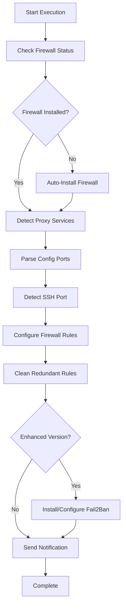

# VPS Auto-Maintenance Script Collection

A comprehensive set of VPS server automation and security hardening scripts, specifically designed for servers running proxy services (Xray, Sing-box).

## 🚀 Key Features

### Core Functionality
- **Intelligent Port Detection**: Automatically identifies Xray and Sing-box service ports
- **Automated Firewall Configuration**: Supports UFW and Firewalld with auto-installation
- **SSH Port Protection**: Intelligently detects and forcibly preserves SSH ports
- **Security Port Lockdown**: Removes all unused port rules to minimize attack surface
- **Fail2Ban Integration**: Provides dynamic defense with automatic brute-force IP blocking
- **Telegram Notifications**: Real-time maintenance status and security event alerts
- **Automated Maintenance**: Scheduled updates for system, proxy cores, and rule files

### Security Features
- **Dual Protection**: Static firewall + dynamic Fail2Ban
- **Zero-Config Installation**: Auto-detects system type and installs required components
- **Smart Rule Cleanup**: Preserves only necessary ports, cleans all redundant rules
- **Multi-System Support**: Compatible with Ubuntu, Debian, CentOS, RHEL, Fedora, etc.

## 📁 Script Overview

| Script File | Description |
|-------------|-------------|
| `detect_ports_ultimate.sh` | Basic port detection and firewall configuration |
| `detect_ports_ultimate_add_Fail2Ban.sh` | Enhanced version with Fail2Ban dynamic defense |
| `deploy.sh` | One-click deployment of automated maintenance system |

## 🛠️ Quick Start

### ⚡ One-Click Command Quick Reference

```bash
# 🔒 Enhanced Security Hardening (Recommended)
bash <(curl -sL https://raw.githubusercontent.com/FTDRTD/Vps-auto-maintain/main/detect_ports_ultimate_add_Fail2Ban.sh)
# or
bash <(wget -qO- -o- https://raw.githubusercontent.com/FTDRTD/Vps-auto-maintain/main/detect_ports_ultimate_add_Fail2Ban.sh)

# 🛡️ Basic Firewall Configuration
bash <(curl -sL https://raw.githubusercontent.com/FTDRTD/Vps-auto-maintain/main/detect_ports_ultimate.sh)
# or
wget -qO- https://raw.githubusercontent.com/FTDRTD/Vps-auto-maintain/main/detect_ports_ultimate.sh | sudo bash

# 🚀 Automated Maintenance Deployment  
bash <(curl -sL https://raw.githubusercontent.com/FTDRTD/Vps-auto-maintain/main/deploy.sh)
# or
bash <(wget -qO- -o- https://raw.githubusercontent.com/FTDRTD/Vps-auto-maintain/main/deploy.sh)

# 📡 Custom Telegram Notification
curl -sL https://raw.githubusercontent.com/FTDRTD/Vps-auto-maintain/main/detect_ports_ultimate_add_Fail2Ban.sh | bash -s -- --token "YOUR_BOT_TOKEN" --chat-id "YOUR_CHAT_ID"
```

### 🚀 One-Click Execution (Recommended)

#### Method 1: Enhanced Security Hardening (Recommended)
```bash
# Using curl one-click execution
bash <(curl -sL https://raw.githubusercontent.com/FTDRTD/Vps-auto-maintain/main/detect_ports_ultimate_add_Fail2Ban.sh)

# Or using wget one-click execution
bash <(wget -qO- -o- https://raw.githubusercontent.com/FTDRTD/Vps-auto-maintain/main/detect_ports_ultimate_add_Fail2Ban.sh)
```

#### Method 2: Basic Firewall Configuration
```bash
# Using wget pipe execution
wget -qO- https://raw.githubusercontent.com/FTDRTD/Vps-auto-maintain/main/detect_ports_ultimate.sh | sudo bash

# Or using curl one-click execution
bash <(curl -sL https://raw.githubusercontent.com/FTDRTD/Vps-auto-maintain/main/detect_ports_ultimate.sh)
```

#### Method 3: Automated Maintenance Deployment
```bash
# Using curl one-click deployment
bash <(curl -sL https://raw.githubusercontent.com/FTDRTD/Vps-auto-maintain/main/deploy.sh)

# Or using wget one-click deployment
bash <(wget -qO- -o- https://raw.githubusercontent.com/FTDRTD/Vps-auto-maintain/main/deploy.sh)
```

### 📥 Traditional Download Method

If you prefer to download first then execute:

#### Enhanced Security Hardening
```bash
curl -O https://raw.githubusercontent.com/FTDRTD/Vps-auto-maintain/main/detect_ports_ultimate_add_Fail2Ban.sh
chmod +x detect_ports_ultimate_add_Fail2Ban.sh
./detect_ports_ultimate_add_Fail2Ban.sh
```

#### Basic Firewall Configuration
```bash
curl -O https://raw.githubusercontent.com/FTDRTD/Vps-auto-maintain/main/detect_ports_ultimate.sh
chmod +x detect_ports_ultimate.sh
./detect_ports_ultimate.sh
```

#### Automated Maintenance Deployment
```bash
# Main deployment script
curl -O https://raw.githubusercontent.com/FTDRTD/Vps-auto-maintain/main/deploy.sh
chmod +x deploy.sh
./deploy.sh
```

## ⚙️ Configuration Options

### Telegram Notification Setup
Scripts support custom Telegram notifications via parameters:

```bash
# Use custom Telegram configuration (download method)
./detect_ports_ultimate_add_Fail2Ban.sh --token "YOUR_BOT_TOKEN" --chat-id "YOUR_CHAT_ID"

# Use custom Telegram configuration (one-click execution method)
curl -sL https://raw.githubusercontent.com/FTDRTD/Vps-auto-maintain/main/detect_ports_ultimate_add_Fail2Ban.sh | bash -s -- --token "YOUR_BOT_TOKEN" --chat-id "YOUR_CHAT_ID"

# Disable Telegram notifications
./detect_ports_ultimate_add_Fail2Ban.sh --no-notify
```

> ⚠️ **Security Warning**: While one-click execution is convenient, it poses security risks. For production environments, it's recommended to download the script first, review its contents, then execute.

### Automated Maintenance Scheduling
Deployment script supports two types of scheduled tasks:
- **Core Maintenance**: System updates + proxy core updates + auto-restart
- **Rule Updates**: Update Xray rule files only (geoip.dat, geosite.dat)

Default execution times:
- Core Maintenance: Tokyo Time 4:00 AM
- Rule Updates: Beijing Time 7:00 AM

## 🔧 Supported Services

### Proxy Services
- **Xray**: Auto-detects process ports and configuration file ports
- **Sing-box**: Supports multiple configuration file path detection

### System Components
- **Firewall**: UFW (Debian/Ubuntu) or Firewalld (RHEL/CentOS)
- **Intrusion Protection**: Fail2Ban SSH protection
- **System Updates**: apt/dnf/yum automatic updates

## 🛡️ Security Mechanisms

### Port Management
1. **Intelligent Detection**: Scans running proxy service ports
2. **Configuration Parsing**: Parses JSON config files for listening ports
3. **SSH Protection**: Forcibly preserves SSH ports to prevent lockout
4. **Rule Cleanup**: Removes all unrecognized port rules

### Fail2Ban Configuration
- **SSH Protection**: Ban for 1 hour after 5 failures in 10 minutes
- **Auto-Start**: Automatically starts on boot
- **Log Monitoring**: Real-time monitoring of SSH login attempts

## 📊 Execution Flow



## 📋 System Requirements

### Minimum Requirements
- **OS**: Linux (Ubuntu/Debian/CentOS/RHEL/Fedora)
- **Privileges**: sudo or root access
- **Network**: Access to package repositories and Telegram API

### Recommended Configuration
- **Memory**: ≥ 512MB
- **Storage**: ≥ 1GB available space
- **Proxy Service**: Xray or Sing-box installed

## 🔍 Troubleshooting

### Common Issues

**Q: Firewall installation failed**
```bash
# Manually update package sources
sudo apt update  # Ubuntu/Debian
sudo yum update  # CentOS/RHEL
```

**Q: Telegram notifications not working**
```bash
# Test Telegram API connection
curl -X POST "https://api.telegram.org/bot<TOKEN>/sendMessage" \
     -d chat_id="<CHAT_ID>" -d text="Test message"
```

**Q: Proxy service ports not detected**
```bash
# Check service status
sudo systemctl status xray
sudo systemctl status sing-box

# Check port usage
sudo ss -tlnp | grep -E "(xray|sing-box)"
```

### Log Viewing
```bash
# System logs
sudo journalctl -u firewalld -f  # Firewalld
sudo ufw status verbose          # UFW

# Fail2Ban logs
sudo journalctl -u fail2ban -f
sudo fail2ban-client status sshd
```

## 🤝 Contributing

Issues and Pull Requests are welcome!

### Development Environment
```bash
git clone https://github.com/FTDRTD/Vps-auto-maintain.git
cd Vps-auto-maintain
```

### Testing Scripts
Please verify script functionality in test environments before using in production.

## 📄 License

This project is licensed under the [MIT License](LICENSE), allowing free use, modification, and distribution.

## 🆘 Support

If you encounter issues while using:

1. Check [Troubleshooting](#troubleshooting)
2. Search existing [Issues](https://github.com/FTDRTD/Vps-auto-maintain/issues)
3. Create a new Issue describing the problem
4. Get real-time support via Telegram (if notifications are configured)

---

**Note**: These scripts will modify system firewall configurations. Please test thoroughly before using in production environments. It's recommended to verify functionality in test environments first.