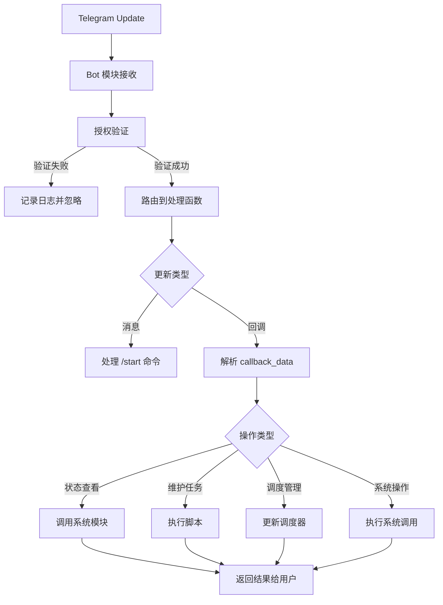
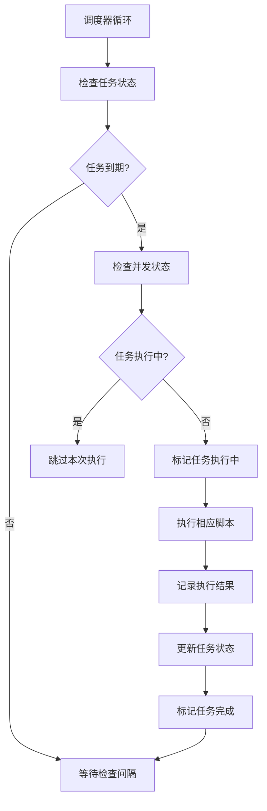

# VPS Telegram Bot (Rust Port) 架构设计

## 1. 项目概述

本架构设计基于 `SPECIFICATION.md` 和 `PSEUDOCODE.md`，旨在将 VPS 管理 Telegram Bot 从 Python 移植到 Rust。目标包括：

- **性能提升**：利用 Rust 的零成本抽象和内存安全特性
- **减少依赖**：移除 Python 运行时和 uv 环境管理
- **安全性增强**：通过 Rust 的内存安全特性和严格的类型系统
- **可维护性**：清晰的模块化架构和完整的错误处理

## 2. 项目结构

```
Rust/
├── src/
│   ├── main.rs                 # 程序入口点
│   ├── config.rs              # 配置管理模块
│   ├── bot.rs                 # Telegram Bot 交互
│   ├── system.rs              # 系统调用封装
│   ├── scheduler.rs           # 定时任务调度器
│   ├── error.rs               # 错误类型定义
│   ├── types.rs               # 共享数据类型
│   └── utils.rs               # 工具函数
├── Cargo.toml                 # 项目配置和依赖
├── ARCHITECTURE.md            # 本架构文档
├── tests/
│   ├── config_tests.rs        # 配置模块测试
│   ├── scheduler_tests.rs     # 调度器测试
│   ├── system_tests.rs        # 系统模块测试（模拟）
│   └── bot_tests.rs           # Bot 逻辑测试
└── scripts/
    └── install.sh             # 安装脚本
```

## 3. 核心模块设计

### 3.1 Main 模块 (`main.rs`)

**职责**：
- 应用程序入口点
- 协调各模块初始化
- 处理启动时的错误恢复

**关键功能**：
```rust
fn main() -> Result<(), Box<dyn std::error::Error>> {
    // 1. 初始化日志系统
    env_logger::init();
    
    // 2. 加载配置
    let config = Config::from_env()?;
    
    // 3. 初始化组件
    let system = Arc::new(RealSystem);
    let scheduler = Scheduler::new(&config, Arc::clone(&system))?;
    let bot = Bot::new(&config, Arc::clone(&system))?;
    
    // 4. 启动服务
    let (tx, rx) = mpsc::channel();
    
    // 启动调度器线程
    let scheduler_handle = thread::spawn(move || {
        scheduler.run(rx);
    });
    
    // 启动 Bot（阻塞运行）
    bot.start_polling(tx)?;
    
    Ok(())
}
```

### 3.2 配置模块 (`config.rs`)

**职责**：
- 环境变量解析和验证
- 持久化配置管理
- 配置默认值设置

**核心结构**：
```rust
#[derive(Debug, Clone)]
pub struct Config {
    pub tg_token: String,
    pub tg_chat_id: i64,
    pub state_path: PathBuf,
    pub scripts_path: PathBuf,
    pub logs_service: String,
}

pub struct ConfigError;

impl Config {
    pub fn from_env() -> Result<Self, ConfigError> {
        // 环境变量验证
        // 默认路径设置
        // 错误处理
    }
}
```

### 3.3 Bot 模块 (`bot.rs`)

**职责**：
- Telegram API 交互
- 消息路由和授权验证
- 用户界面管理（键盘、菜单）

**关键设计**：
```rust
pub struct Bot {
    api: TelegramApi,
    system: Arc<dyn SystemOps>,
}

impl Bot {
    pub fn start_polling(&self, admin_id: i64, scheduler_tx: mpsc::Sender<SchedulerCommand>) {
        // 轮询 Telegram 更新
        // 授权验证
        // 回调处理
    }
    
    fn is_authorized(&self, chat_id: i64, admin_id: i64) -> bool {
        chat_id == admin_id
    }
}
```

### 3.4 系统模块 (`system.rs`)

**职责**：
- 封装所有系统调用
- 提供测试友好的接口
- 处理脚本执行和超时

**Trait 设计**：
```rust
pub trait SystemOps: Send + Sync {
    fn execute_script(&self, path: &str, timeout: Duration) -> Result<ScriptResult, SystemError>;
    fn get_system_info(&self) -> Result<SystemInfo, SystemError>;
    fn reboot_system(&self) -> Result<(), SystemError>;
    fn get_service_logs(&self, service: &str, lines: usize) -> Result<String, SystemError>;
    fn check_file_exists(&self, path: &str) -> bool;
}
```

### 3.5 调度器模块 (`scheduler.rs`)

**职责**：
- 定时任务管理
- 任务状态持久化
- 并发控制

**状态机设计**：
```rust
pub struct Scheduler {
    jobs: HashMap<JobType, ScheduledJob>,
    state_manager: StateManager,
    system: Arc<dyn SystemOps>,
}

#[derive(Debug, Clone, Copy, PartialEq)]
pub enum JobType {
    CoreMaintain,
    RulesUpdate,
}

pub struct ScheduledJob {
    job_type: JobType,
    schedule: cron::Schedule,
    enabled: bool,
    last_run: Option<DateTime<Utc>>,
}
```

## 4. 数据流设计

### 4.1 消息处理流程



### 4.2 定时任务流程



## 5. 错误处理策略

### 5.1 错误类型定义

```rust
#[derive(Debug, thiserror::Error)]
pub enum BotError {
    #[error("Configuration error: {0}")]
    Config(#[from] ConfigError),
    
    #[error("System operation failed: {0}")]
    System(#[from] SystemError),
    
    #[error("Telegram API error: {0}")]
    Telegram(#[from] TelegramError),
    
    #[error("Scheduler error: {0}")]
    Scheduler(#[from] SchedulerError),
    
    #[error("Timeout error: operation took longer than {0:?}")]
    Timeout(Duration),
}
```

### 5.2 错误恢复策略

- **配置错误**：启动时验证，缺失则panic
- **网络错误**：指数退避重试机制
- **系统错误**：记录详细日志，返回用户友好错误信息
- **脚本执行错误**：捕获输出，分析错误类型，提供诊断信息

## 6. Cargo.toml 依赖设计

```toml
[package]
name = "vps-tg-bot"
version = "1.0.0"
edition = "2021"
authors = ["Your Name"]
description = "VPS management Telegram bot written in Rust"
license = "MIT"

[dependencies]
# 异步运行时
tokio = { version = "1.0", features = ["full"] }

# Telegram Bot API
teloxide = "0.12"
reqwest = { version = "0.11", features = ["json"] }

# 任务调度
cron = "0.12"
chrono = { version = "0.4", features = ["serde"] }

# 序列化
serde = { version = "1.0", features = ["derive"] }
serde_json = "1.0"

# 日志
log = "0.4"
env_logger = "0.10"

# 错误处理
thiserror = "1.0"

# 系统操作
users = "0.13"

# 正则表达式
regex = "1.0"

# 异步 HTTP 客户端
reqwest = { version = "0.11", features = ["json", "stream"] }

# 时间处理
chrono-tz = "0.8"

[dev-dependencies]
# 测试
tempfile = "3.0"
mockall = "0.12"
tokio-test = "0.4"

# 文档测试
trybuild = "1.0"

[features]
default = []
# 启用调试功能
debug = []
```

## 7. 安全性设计

### 7.1 访问控制

```rust
fn validate_authorization(&self, update: &Update, admin_id: i64) -> Result<(), SecurityError> {
    if update.chat_id != admin_id {
        log::warn!(
            "Unauthorized access attempt from chat_id: {}",
            update.chat_id
        );
        return Err(SecurityError::UnauthorizedAccess);
    }
    Ok(())
}
```

### 7.2 输入验证

- **回调数据验证**：使用白名单验证 callback_data
- **路径验证**：确保脚本路径在允许的目录范围内
- **参数验证**：验证所有用户输入参数

### 7.3 权限最小化

- **沙箱执行**：脚本在受限环境中执行
- **环境隔离**：清理子进程环境变量
- **资源限制**：设置CPU和内存使用限制

## 8. 测试策略

### 8.1 单元测试结构

```rust
#[cfg(test)]
mod tests {
    use super::*;
    use mockall::mock;
    
    mock! {
        SystemOps
        dyn SystemOps: Send + Sync {
            fn execute_script(&self, path: &str, timeout: Duration) -> Result<ScriptResult, SystemError>;
            fn get_system_info(&self) -> Result<SystemInfo, SystemError>;
        }
    }
    
    #[tokio::test]
    async fn test_config_validation() {
        // 测试配置验证逻辑
    }
    
    #[test]
    fn test_scheduler_job_management() {
        // 测试任务管理逻辑
    }
}
```

### 8.2 集成测试

- **模拟 Telegram API**：使用 mock 服务器
- **模拟系统调用**：使用 filesystem mock
- **端到端测试**：完整工作流测试

### 8.3 测试覆盖目标

- **配置模块**：100% 覆盖率
- **授权逻辑**：100% 覆盖率
- **错误处理**：90% 覆盖率
- **核心业务逻辑**：95% 覆盖率

## 9. 性能优化

### 9.1 并发设计

- **异步 I/O**：使用 tokio 处理网络操作
- **线程池**：CPU 密集型任务使用专用线程池
- **消息队列**：调度器和 Bot 间的无锁通信

### 9.2 内存优化

- **零拷贝**：使用引用避免不必要的数据复制
- **对象池**：重用昂贵的系统资源
- **智能指针**：合理使用 Arc、Box 等

## 10. 部署和运维

### 10.1 构建配置

```toml
# Release 配置优化
[profile.release]
opt-level = 3
debug = false
strip = true
lto = true
codegen-units = 1
panic = "abort"
```

### 10.2 系统服务

创建 systemd 服务单元：
```ini
[Unit]
Description=VPS Telegram Bot
After=network.target

[Service]
Type=simple
User=root
ExecStart=/usr/local/bin/vps-tg-bot
Restart=always
RestartSec=10
Environment=TG_TOKEN=your_token
Environment=TG_CHAT_ID=your_chat_id

[Install]
WantedBy=multi-user.target
```

### 10.3 监控和日志

- **结构化日志**：使用 JSON 格式输出到 journald
- **健康检查**：提供 HTTP 健康检查端点（可选）
- **性能指标**：收集执行时间和资源使用情况

## 11. 扩展性考虑

### 11.1 模块化设计

- **插件系统**：预留插件加载接口
- **配置热重载**：支持运行时配置更新
- **多实例支持**：支持多个 Bot 实例

### 11.2 API 设计

- **RESTful 接口**：提供管理 API（可选）
- **Webhook 支持**：替代轮询模式
- **事件系统**：支持自定义事件处理

## 12. 总结

本架构设计遵循以下原则：

1. **单一职责**：每个模块都有明确的职责边界
2. **依赖倒置**：通过 trait 实现依赖抽象
3. **错误处理**：全面的错误处理和恢复机制
4. **测试友好**：每个模块都可独立测试
5. **性能优先**：异步设计和零成本抽象
6. **安全第一**：多层安全验证和权限控制

该架构为项目的可维护性、可扩展性和可靠性奠定了坚实基础。